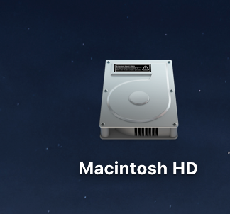

# Markdown 语法

## 目录
- [横线](#横线)
- [标题](#标题)
- [文本](#文本)
  - 普通文本
  - 单行文本
  - 多行文本
  - 文字高亮
  - 换行
  - 斜体
  - 粗体
  - 删除线
- [图片](#图片)
  - 来自网络的图片
  - Github仓库中的图片

-------
### 横线
\***/---可实现横线分割线的效果
***
----
### 标题
*#* 实现多级标题
# 一级标题
## 二级标题
### 三级标题
#### 四级标题
##### 五级标题
###### 六级标题

### 文本
#### 普通文本
这是一段普通的文本
#### 单行文本
    文本开头加入两个tab或4个空格
#### 文本块
```
\```
文本块
\```
```
#### 文字高亮
`用一对反引号括起来`

#### 换行
在上一行文本后面补两个空格，  
这样就可以实现换行了

#### 斜体、粗体、删除线
语法|效果
----|----
`*斜体*`|*斜体*
`**粗体**`|**粗体**
`~~删除线~~`|~~删除线~~
`***斜粗体***`|***斜粗体***
`***~~斜粗体删除线~~***`|***~~斜粗体删除线~~***
    斜体、粗体、删除线可混合使用
   
#### 图片
基本格式：``
- alt表示图片显示失败时的替换文本（可省略）
- title表示鼠标悬停在图片时显示的文本（可省略）
- URL即图片的url地址，如果引用本仓库中的图片，直接引用相对路径，其他图片则要绝对路径

|语法|效果|
|---|----|
|``||
|``||
